<p align="center"></p>

# Budkin

Ứng dụng desktop quản lý công việc (Windows / macOS / Ubuntu, giao diện **tiếng Việt / English**) với giao diện là **một bàn làm
việc 3D**:

- **Máy tính ở giữa** — màn hình của nó chính là nơi quản lý việc (danh sách, Kanban, lịch).
- **Budkin, chú robot nhỏ bên trái** — luôn nhìn theo con trỏ chuột, báo hiệu khi có việc sắp đến hạn / đến hạn.
- **Đèn bàn bên phải** — bật / tắt đèn để đổi giữa hai theme.

Phong cách: thế giới hiện đại hậu tận thế, tông tối — tường bê tông nứt, cửa sổ vỡ nhìn ra thành phố đổ nát, còn đồ
trên bàn là thiết bị hiện đại (graphite, nhôm, kính đen, đèn LED xanh ngọc) trên mặt bàn gỗ óc chó sẫm. **Bật đèn** là
chạng vạng dưới ánh đèn LED trắng ấm; **tắt đèn** là mất điện ban đêm — chỉ còn màn hình, đèn nền bàn phím và mắt
robot phát sáng.

| Bật đèn (chạng vạng) | Tắt đèn (mất điện) |
|---|---|
| 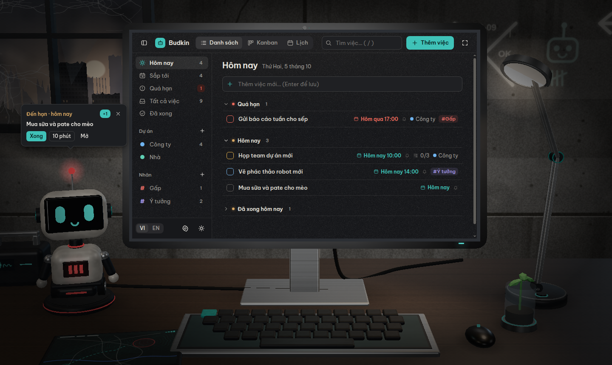 | 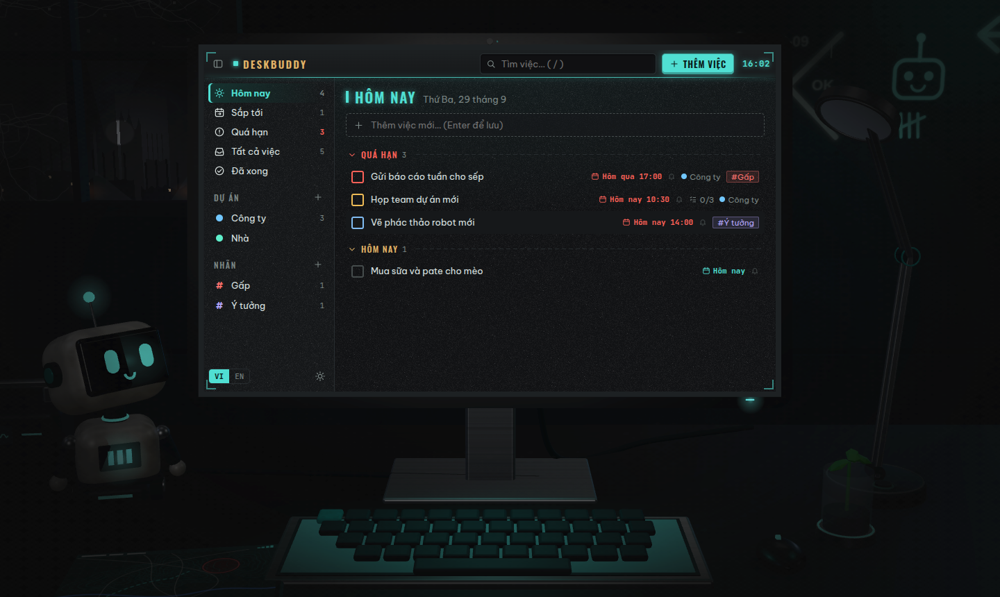 |

Dữ liệu chỉ nằm trên máy của bạn, không cần tài khoản, không gửi đi đâu — trừ khi bạn tự
[kết nối Claude](#hỏi-đáp-và-giao-việc-cho-claude) để hỏi đáp, giao việc bằng lời.

## Robot trên bàn

| Budkin | Orbi | Rover | Miu | Mech |
|---|---|---|---|---|
|  | 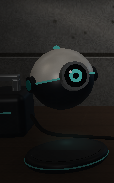 | 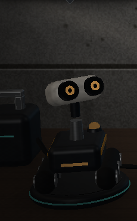 |  |  |

Robot đứng trên một **bệ tròn** có vòng LED: **bấm vào bệ** để đổi sang robot kế tiếp (robot cũ xoay rồi chìm vào bệ,
robot mới trồi lên chào bạn), hoặc chọn trong Cài đặt → Chung. Robot nào cũng nhìn theo con trỏ, báo khi có việc đến
hạn, bấm vào thì tóm tắt việc hôm nay, lâu không thao tác thì ngủ — nhưng mỗi robot một tính cách: dáng, hoạt cảnh,
giọng, lời thoại và kiểu bong bóng riêng.

- **Budkin** — robot bánh xe vui tính: bị chọc thì bẹp-giãn, ăn mừng thì nhảy xoay một vòng, báo động thì nhún nhảy.
- **Orbi** — quả cầu bay điềm tĩnh, một mắt ống kính (con trỏ lại gần thì mống mắt nở ra): bị chọc thì xoay tròn,
  ăn mừng thì bay một vòng và lộn nhào, ngủ thì đáp xuống nằm trên bệ. Nói ngắn gọn, giọng "bloop" trong như chuông.
- **Rover** — xe bánh xích hăng hái với cột kính tiềm vọng: bị chọc thì lùi rồi chạy lên, ăn mừng thì xoay tại chỗ,
  báo động thì đèn hiệu trên lưng nhấp nháy đỏ, ngủ thì thu cột kính. Nói như báo cáo ngoài thực địa, bíp 8-bit.
- **Miu** — mèo máy tinh nghịch: con trỏ lại gần thì vểnh tai, bị chọc thì rung rừ rừ mắt cười, báo động thì tai đỏ
  nhấp nháy và vẫy đuôi, ngủ thì nằm xuống quấn đuôi. Nói "Meo~", kêu meo meo.
- **Mech** — người máy hai chân nghiêm túc: bị chọc thì chào kiểu nhà binh, ăn mừng thì giơ hai tay, báo động thì
  giơ tay xin chú ý, ngủ thì ngồi thụp xuống. Nói kiểu báo cáo "Đã kiểm tra: …", giọng máy trầm.

## Bàn làm việc 2D

| Bật đèn | Tắt đèn |
|---|---|
| 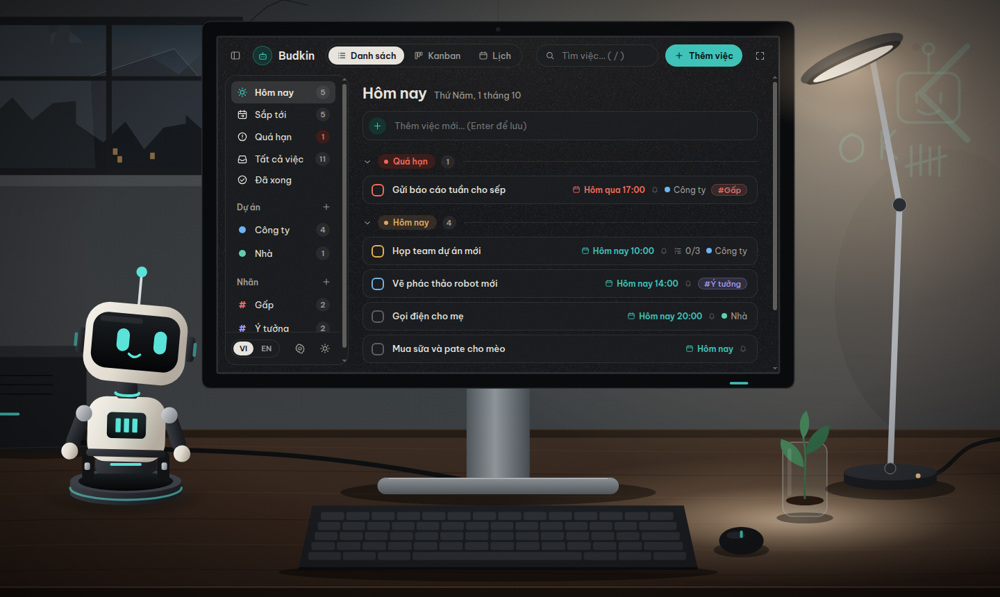 | 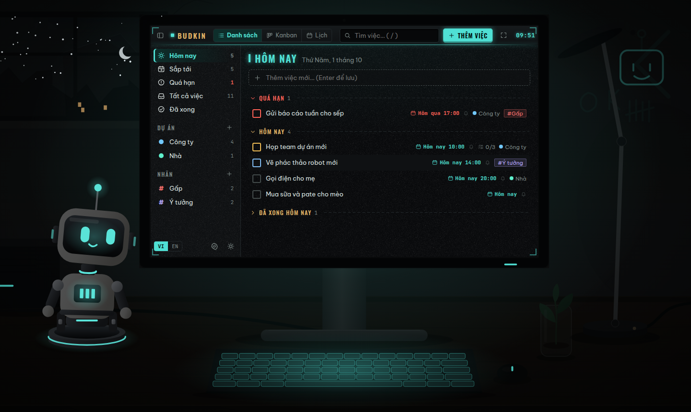 |

Máy không có WebGL, GPU hay gặp lỗi, hoặc khi chọn **Chỉ 2D** (Cài đặt → Hiển thị): cả bàn làm việc được vẽ lại bằng
tranh vector, cùng phong cách và bố cục với bản 3D. Vẫn đủ 5 robot trên bệ tròn với dáng, giọng, lời thoại riêng: nhìn
theo con trỏ, chớp mắt, bị chọc thì phản ứng, ăn mừng, báo động khi đến hạn, ngủ có "Zzz"; bấm bệ để đổi robot (robot cũ
chìm xuống, robot mới trồi lên), bấm đèn bàn để bật / tắt đèn. Bản 2D nhẹ hơn nhiều so với 3D vẽ bằng CPU: đo trên máy
không có GPU, rê chuột liên tục tốn khoảng 1/3 một lõi CPU (3D vẽ bằng CPU: gần 14 lõi), để yên gần như 0.

## Tải và cài đặt

Bộ cài có ở trang [Releases](https://github.com/HoangDuong2k/Budkin/releases) (khi đã phát hành), hoặc bản build mới
nhất trong tab **Actions** → lần chạy xanh gần nhất của nhánh `main` → mục **Artifacts** (`budkin-Windows`,
`budkin-macOS`, `budkin-Linux`; cần đăng nhập GitHub). Muốn tự đóng gói thì xem [Đóng gói bộ cài](#đóng-gói-bộ-cài).

### Windows 10 / 11

1. Chạy `Budkin-Setup-x.y.z.exe`. Bộ cài cho người dùng hiện tại, không cần quyền Administrator; có lối tắt trên
   Desktop và Start Menu.
2. Bộ cài chưa ký số nên SmartScreen có thể chặn lần chạy đầu (**"Windows protected your PC"**): bấm **More info**
   rồi **Run anyway** (Windows tiếng Việt có hai nút tương ứng).

Bấm chuột phải vào biểu tượng Budkin trên thanh tác vụ có mục **Thêm việc nhanh**.

### macOS 13 (Ventura) trở lên

Mac chip Apple (M1 trở lên) dùng `Budkin-x.y.z-arm64.dmg`, Mac chip Intel dùng `Budkin-x.y.z-x64.dmg` (xem ở menu Apple →
**About This Mac**).

1. Mở file `.dmg`, kéo **Budkin** vào thư mục **Applications** bên cạnh.
2. Budkin chưa được ký bằng chứng chỉ Apple Developer nên lần đầu mở macOS chặn (**"Budkin" Not Opened** / *Apple could
   not verify…*): bấm **Done**, vào **System Settings → Privacy & Security**, kéo xuống mục **Security**, bấm **Open
   Anyway** cạnh dòng báo Budkin bị chặn rồi xác nhận. Chỉ phải làm một lần. (macOS 14 trở về trước: chuột phải vào
   Budkin trong Applications → **Open** cũng được.) Hoặc chạy trong Terminal:

   ```bash
   xattr -dr com.apple.quarantine /Applications/Budkin.app
   ```

Biểu tượng robot trên **thanh menu** (góc trên bên phải) có menu nhanh; bấm chuột phải vào biểu tượng Budkin trên Dock
có mục **Thêm việc nhanh**. Phím tắt dùng ⌘ thay cho Ctrl (⌘, mở Cài đặt, ⌘Q thoát hẳn).

### Ubuntu 24.04 trở lên

```bash
sudo apt install ./budkin_x.y.z_amd64.deb
```

Mở Budkin từ danh sách ứng dụng (hoặc lệnh `budkin`). Gói `.deb` tự cài profile AppArmor để sandbox của Chromium chạy
được trên Ubuntu 24.04+. Bấm chuột phải vào biểu tượng trên dock có mục **Thêm việc nhanh**.

Muốn có biểu tượng ở **khay hệ thống** (chạy nền để nhắc việc, menu nhanh), cần bật tiện ích AppIndicator — xem
[Xử lý sự cố](#xử-lý-sự-cố).

### AppImage (bản chạy không cần cài, cho các bản Linux khác)

```bash
chmod +x Budkin-x.y.z.AppImage
./Budkin-x.y.z.AppImage
```

Không cần cài `libfuse2`. Máy không có FUSE thì chạy `./Budkin-x.y.z.AppImage --appimage-extract-and-run`.

### Gỡ cài đặt

- **Windows:** Settings → Apps → Budkin → Uninstall. Mục "khởi động cùng Windows" được xoá theo.
- **macOS:** nếu đã bật "Khởi động cùng máy", tắt trong Cài đặt trước (hoặc xoá
  `~/Library/LaunchAgents/com.budkin.app.login.plist`), rồi kéo Budkin từ Applications vào Thùng rác.
- **Ubuntu:** `sudo apt remove budkin`. Nếu đã bật "Khởi động cùng máy", tắt trong Cài đặt trước khi gỡ (hoặc xoá
  `~/.config/autostart/budkin.desktop`).

Gỡ cài đặt **không xoá dữ liệu** — cài lại là còn nguyên việc. Muốn xoá hẳn thì xoá thư mục dữ liệu:
`%APPDATA%\Budkin` (Windows), `~/Library/Application Support/Budkin` (macOS) hoặc `~/.config/Budkin` (Ubuntu).

## Danh sách, Kanban, Lịch

| Kanban | Lịch |
|---|---|
| 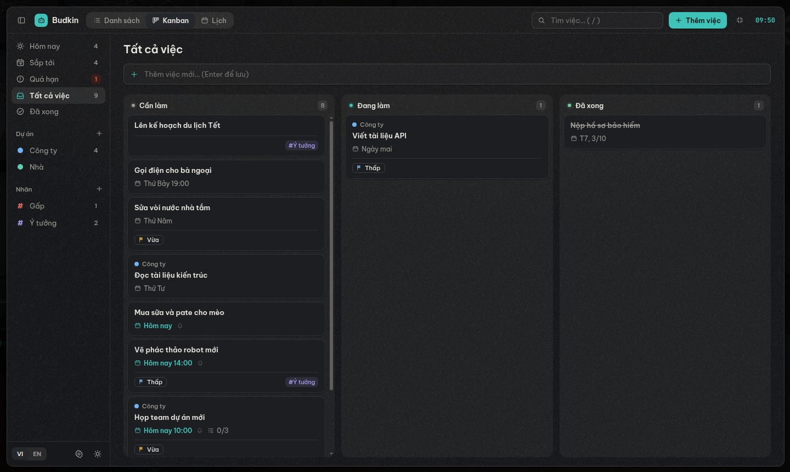 | 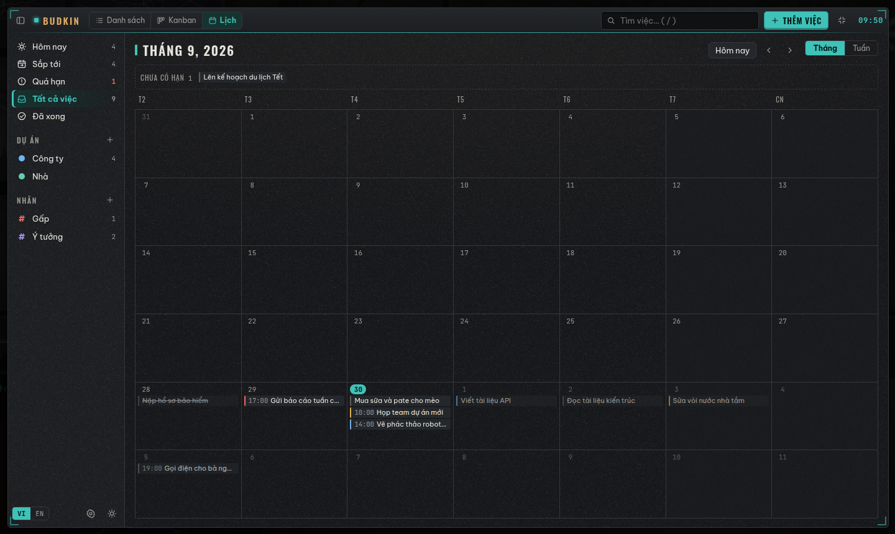 |

- **Danh sách:** Hôm nay, Sắp tới, Quá hạn, Tất cả, Đã xong; dự án và nhãn ở thanh bên; tìm kiếm không cần gõ dấu
  ("bao cao" ra "Báo cáo"). Mỗi việc có hạn, giờ, nhắc việc, ưu tiên, dự án, nhãn, checklist, ghi chú.
- **Kanban:** 3 cột Cần làm / Đang làm / Đã xong, kéo thả thẻ bằng chuột (hoặc bàn phím: Tab tới thẻ, Space nhấc lên,
  phím mũi tên di chuyển, Space thả). Kéo sang "Đã xong" là Budkin ăn mừng.
- **Lịch:** tháng hoặc tuần; kéo việc sang ngày khác để đổi hạn (nhắc việc tự đặt lại), kéo lên dải "Chưa có hạn" để bỏ
  hạn, kéo việc chưa có hạn xuống một ngày để xếp lịch.
- Kanban và Lịch đều lọc theo dự án / nhãn đang chọn và ô tìm kiếm.
- **Chế độ Mở rộng** (phím **F**): giao diện phủ gần kín cửa sổ, cảnh 3D tạm dừng — tiện khi cửa sổ nhỏ.

Phím tắt: **1 / 2 / 3** đổi cách xem · **N** thêm việc · **/** tìm · **F** Mở rộng · **Esc** đóng / thoát ·
**Ctrl+Shift+L** bật / tắt đèn · **Ctrl+,** Cài đặt · **Ctrl+Q** thoát hẳn (macOS: ⌘ thay cho Ctrl).

## Việc lặp lại

- Ô **Lặp lại** trong khung sửa (việc cần có hạn): hằng ngày, ngày làm việc (T2–T6), hằng tuần, hằng tháng (hoặc ngày
  cuối tháng), hằng năm, hay **Tuỳ chỉnh…**: mỗi N ngày / tuần / tháng / năm, chọn các thứ trong tuần, kết thúc vào một
  ngày hoặc sau N lần, tính lần sau từ hạn của lần này hay từ ngày hoàn thành.
- Hoàn thành một lần (bấm ô tròn, "Xong" trên nhắc việc, kéo sang cột "Đã xong") là lần kế tiếp tự xuất hiện, kèm toast
  "Lần tới: …" có nút **Hoàn tác**. Hạn ngày 31 không bị trôi (31/1 → 28/2 → 31/3); việc quá hạn lâu thì lần kế tiếp là
  lần gần nhất tính từ hôm nay.
- **Bỏ qua lần này** dời việc sang lần kế tiếp; khi xoá thì chọn xoá riêng lần này hay cả chuỗi (các lần đã xong vẫn
  giữ lại).
- Lịch hiện mờ các lần lặp sắp tới.

## Nhắc việc, chạy nền

- Mỗi việc có hạn đặt được mức nhắc: không nhắc, đúng giờ, hoặc trước N phút / giờ / ngày (nhắc "sắp đến hạn" rồi
  nhắc lần nữa lúc "đến hạn"). Việc cả ngày nhắc lúc 9:00 (đổi được trong Cài đặt).
- Tới giờ, **Budkin** báo động (đèn đỏ, nhún nhảy, kêu bíp) và hiện bong bóng thoại: **Xong**, **10 phút** (báo lại),
  **Mở**, **×** (bỏ qua). Cửa sổ quá hẹp (không đủ chỗ cho bong bóng bên trái màn hình) thì nhắc việc hiện thành banner
  ngay trong màn hình.
- Khi đang không dùng app (cửa sổ ẩn / không có focus) thì có thêm thông báo của hệ điều hành. Nhiều việc cùng lúc
  (từ 3 việc) gộp thành một thông báo; nhắc trễ quá 6 giờ (máy tắt, ngủ qua đêm) thì chỉ ghi nhận, không báo.
- Bấm nút đóng: lần đầu Budkin hỏi ẩn xuống khay (vẫn nhắc việc) hay thoát hẳn. Thoát hẳn lúc nào cũng được bằng
  **Ctrl+Q** (macOS: **⌘Q**) hoặc menu ở khay. Menu khay còn có: thêm việc nhanh, tắt nhắc 1 giờ, khởi động cùng máy.
  Trên macOS, cửa sổ ẩn thì bấm biểu tượng Budkin trên Dock để mở lại.
- App mở cả ngày mà gần như không tốn gì: cảnh 3D chỉ vẽ khi có gì đổi; để yên thì robot buồn ngủ rồi ngủ, lúc đó
  cả cửa sổ không phải vẽ lại.

## Cài đặt, dữ liệu, sao lưu

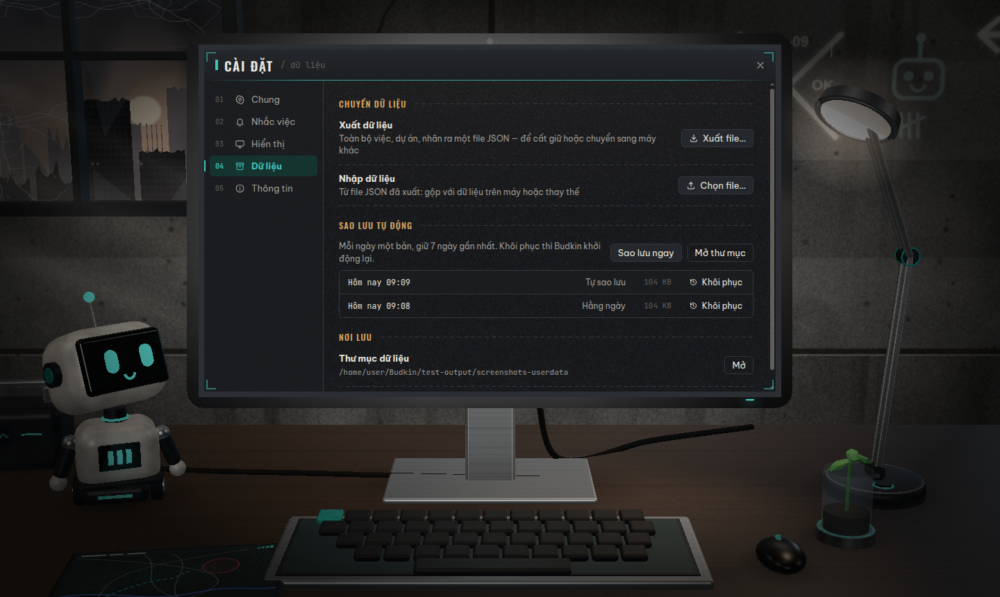

Mở **Cài đặt** bằng nút bánh răng ở chân thanh bên hoặc **Ctrl+,** (macOS: **⌘,**). Đổi là lưu ngay:

- **Chung:** ngôn ngữ, tuần bắt đầu vào thứ Hai hay Chủ nhật, âm thanh và âm lượng, giảm chuyển động.
- **Nhắc việc:** mức nhắc mặc định, giờ nhắc cho việc cả ngày, tạm tắt nhắc (1 giờ / 4 giờ / 1 ngày), bấm nút đóng
  cửa sổ thì chạy nền hay thoát, khởi động cùng máy.
- **Hiển thị:** chất lượng (Cao / Cân bằng / Tiết kiệm); chế độ Tự động, 3D vẽ bằng CPU (máy ảo, GPU lỗi) hoặc
  [Chỉ 2D](#bàn-làm-việc-2d); trên Wayland có thêm lựa chọn chạy qua XWayland. Đổi chế độ thì bấm **Khởi động lại**.
- **Kết nối AI:** quyền của Claude, kết nối Claude Desktop / Claude Code (xem
  [bên dưới](#hỏi-đáp-và-giao-việc-cho-claude)).
- **Dữ liệu:** xuất / nhập, sao lưu, mở thư mục dữ liệu.

Dữ liệu (SQLite) nằm trong thư mục dữ liệu của app: `~/.config/Budkin` trên Linux, `%APPDATA%\Budkin` trên Windows,
`~/Library/Application Support/Budkin` trên macOS.

- **Xuất dữ liệu:** toàn bộ việc, dự án, nhãn, checklist ra một file JSON (kèm các việc đã xoá, để gộp giữa hai máy
  thì việc xoá bên này cũng xoá bên kia). Trạng thái nhắc việc và các thiết lập riêng của máy không đi theo file.
- **Nhập dữ liệu:** chọn file, xem trước số việc rồi chọn **Gộp** (giữ dữ liệu trên máy, việc nào sửa sau cùng thì lấy
  bản đó) hoặc **Thay thế** (dùng đúng dữ liệu trong file). File lạ, file hỏng, file của bản Budkin mới hơn đều bị từ
  chối mà không ghi gì. Trước mỗi lần nhập Budkin tự sao lưu; nhắc việc đã qua giờ trong file không báo dồn lại.
- **Sao lưu tự động** mỗi ngày một bản, giữ 7 ngày gần nhất; thêm **Sao lưu ngay** khi cần. **Khôi phục** một bản thì
  Budkin khởi động lại rồi mới thay dữ liệu; dữ liệu ngay trước lúc khôi phục vẫn được giữ trong một bản sao lưu riêng.
- **Chuyển sang máy khác:** Xuất dữ liệu ở máy cũ → Nhập (Thay thế) ở máy mới.

## Hỏi đáp và giao việc cho Claude

| Claude thêm việc, Budkin báo kèm nút Hoàn tác | Cài đặt → Kết nối AI |
|---|---|
| 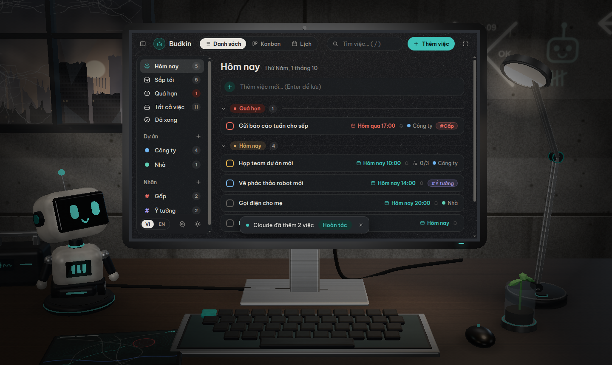 | 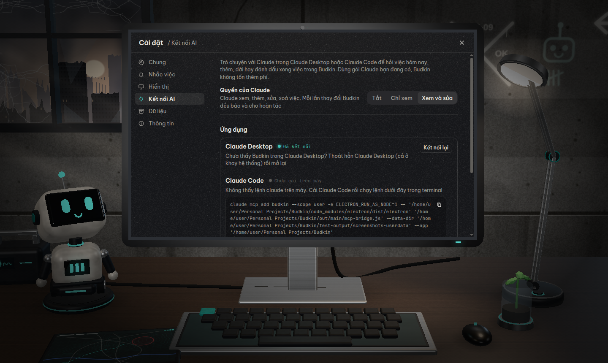 |

Budkin kết nối với **Claude Desktop** và **Claude Code** qua MCP (Model Context Protocol): bạn trò chuyện với Claude như
bình thường — *"hôm nay tôi có việc gì?"*, *"thêm việc gọi điện cho mẹ lúc 8 giờ tối mai"*, *"dời các việc quá hạn sang
thứ Hai"*, *"chia việc Chuyển nhà thành các bước nhỏ"* — còn Claude đọc và sửa việc trong Budkin. Dùng tài khoản Claude
bạn đang có: Budkin không tự gọi AI, không cần API key, không tốn thêm phí.

**Cách bật:** Cài đặt → **Kết nối AI**.

- **Claude Desktop:** bấm **Kết nối** — Budkin thêm mục `budkin` vào `claude_desktop_config.json` (giữ nguyên phần còn
  lại, cất bản gốc thành `claude_desktop_config.json.before-budkin`). Thoát hẳn Claude Desktop rồi mở lại.
- **Claude Code:** bấm **Kết nối** (Budkin chạy `claude mcp add budkin --scope user …`) hoặc chép lệnh hiện sẵn ra
  terminal. Mở phiên mới, gõ `/mcp` để kiểm tra.
- **Ứng dụng AI khác có hỗ trợ MCP:** mục cuối có sẵn cấu hình máy chủ stdio để chép.

**Quyền của Claude:** **Tắt** / **Chỉ xem** / **Xem và sửa** — mặc định Tắt, bấm Kết nối thì chuyển sang Xem và sửa.
Mỗi lần Claude thêm, sửa, xoá việc, robot phản ứng và Budkin hiện thông báo kèm nút **Hoàn tác** (gỡ được trong 15
phút, kể cả hoàn thành việc lặp lại hay dời lịch nhiều việc một lúc). Claude Desktop / Claude Code cũng hỏi bạn trước
khi cho Claude chạy công cụ.

**Claude làm được gì:** xem tổng quan (ngày giờ trên máy, dự án, nhãn, số việc); liệt kê việc hôm nay, quá hạn, sắp
tới, theo khoảng ngày, đã xong, lọc theo dự án / nhãn / từ khoá không dấu; xem chi tiết một việc; thêm nhiều việc một
lúc (hạn, giờ, dự án và nhãn theo tên — chưa có thì tạo, ưu tiên, nhắc, lặp lại, checklist); sửa nhiều việc một lúc
(dời lịch, đổi dự án / nhãn, hoàn thành, thêm và đánh dấu checklist) — sai một việc thì không việc nào bị đổi; xoá việc.

**Budkin đang tắt?** Claude vẫn thấy danh sách công cụ mà không làm Budkin mở theo; khi Claude thực sự cần đọc / sửa
việc, Budkin tự mở chạy nền dưới khay rồi trả lời.

**Riêng tư:** khi bạn hỏi, Claude đọc những việc cần cho câu trả lời qua tài khoản Claude của bạn (theo chính sách dữ
liệu của Anthropic). Quyền ở mức Tắt thì Claude không đọc được gì.

## Xử lý sự cố

**Ubuntu: không thấy biểu tượng Budkin ở khay hệ thống, bấm nút đóng thì cửa sổ chỉ thu nhỏ.** GNOME mặc định không có
khay. Cài và bật tiện ích AppIndicator rồi đăng xuất / đăng nhập lại:

```bash
sudo apt install gnome-shell-extension-appindicator
```

rồi bật **Ubuntu AppIndicators** trong ứng dụng **Extensions**.

**Không thấy thông báo nhắc việc.** Thông báo của hệ điều hành chỉ hiện khi bạn đang không dùng Budkin (cửa sổ ẩn hoặc
đang ở app khác) — lúc đang dùng thì Budkin báo ngay trên bàn. Kiểm tra: Budkin không bị **Tạm tắt nhắc** (Cài đặt →
Nhắc việc); hệ điều hành không ở chế độ **Không làm phiền** / **Focus assist**; Budkin được phép gửi thông báo
(Ubuntu: Settings → Notifications; Windows: Settings → System → Notifications; macOS: System Settings → Notifications →
Budkin — lần đầu có thông báo, macOS hỏi cho phép).

**macOS: không mở được Budkin** (*"Budkin" Not Opened*, *Apple could not verify…*, *is damaged and can't be opened*).
Bản hiện tại chưa ký bằng chứng chỉ Apple Developer: làm theo bước 2 ở [macOS](#macos-13-ventura-trở-lên) (**Open
Anyway**, hoặc lệnh `xattr` trong Terminal). Đang chạy thẳng từ file `.dmg` hay thư mục Downloads thì Budkin đề nghị
chuyển vào Applications — nên đồng ý, nếu không Claude Desktop / Claude Code không tìm lại được Budkin ở lần mở sau.

**Ubuntu: chạy báo lỗi sandbox** (`The SUID sandbox helper binary was found, but is not configured correctly` hoặc
`No usable sandbox`). Ubuntu 24.04+ chặn user namespace cho app không có profile AppArmor: dùng bản `.deb` (tự cài
profile), còn AppImage tự chạy với `--no-sandbox` khi cần. Chạy từ mã nguồn thì dùng `npm run dev:linux`.

**Cảnh 3D đen, giật hoặc app chậm (máy ảo, GPU / driver lỗi).** Cài đặt → Hiển thị → **Chỉ 2D** (bàn làm việc vẽ
phẳng, nhẹ hơn nhiều) hoặc **3D bằng CPU** (nặng — chỉ hợp máy mạnh), rồi Khởi động lại. Budkin tự chuyển sang 2D khi máy không có WebGL, khi cảnh 3D
lỗi, hoặc khi GPU gặp lỗi 2 lần liên tiếp. Nếu cửa sổ không hiện được gì, đặt `"render": "2d"` trong file `boot.json`
ở thư mục dữ liệu rồi mở lại.

**Gõ tiếng Việt bị lỗi trên Wayland** (ibus-bamboo, fcitx5-unikey…). Cài đặt → Hiển thị → bật **Chạy qua XWayland** →
Khởi động lại.

**Muốn quay lại dữ liệu hôm trước.** Cài đặt → Dữ liệu → chọn bản sao lưu → **Khôi phục** (Budkin khởi động lại).

## Phát triển

Yêu cầu: **Node.js 24** (trùng bản Node trong Electron 44 — cần cho `node:sqlite` khi chạy unit test), Git.

```bash
git clone https://github.com/HoangDuong2k/Budkin.git && cd Budkin
nvm install 24 && nvm use   # đọc phiên bản từ .nvmrc
npm install
npm run dev                 # chạy app ở chế độ phát triển
npm run dev:linux           # trên Linux nếu gặp lỗi "SUID sandbox helper"
```

Electron 44 tải file chạy ở lần dùng đầu tiên (không có script postinstall).

### Kiểm thử

```bash
npm run typecheck
npm test                    # vitest: toán khung hình, nhắc việc, dữ liệu, xuất / nhập, sao lưu, công cụ MCP, i18n
npm run build && npm run e2e   # mở app thật, điều khiển bằng chuột / bàn phím, ảnh chụp trong test-output/e2e/
```

- Máy không có GPU (CI, máy ảo): `BUDKIN_E2E_SWIFTSHADER=1 npm run e2e` — WebGL vẽ bằng CPU.
- Kiểm thử bản đã đóng gói / đã cài: `BUDKIN_E2E_EXE=release/linux-unpacked/budkin npm run e2e` (hoặc đường dẫn tới
  file AppImage, `/opt/Budkin/budkin`, `Budkin.exe` đã cài). `npm run install-check` kiểm tra thêm phần chỉ bản cài
  mới có: `--quick-add`, mục "khởi động cùng máy" của hệ điều hành, thư mục dữ liệu mặc định, cầu nối MCP tự mở Budkin
  khi app AI gọi tới (dùng dữ liệu thật của máy — chạy trên máy mình thì đặt `XDG_CONFIG_HOME` sang thư mục tạm).
- Linux không có màn hình (CI): `xvfb-run -a -s "-screen 0 1920x1080x24" npm run e2e`. Trên máy có màn hình, cửa sổ app
  hiện lên trong lúc chạy e2e (không giành focus); cài `xvfb` để chạy ẩn. Phiên đăng nhập Wayland (Ubuntu mặc định) thì
  phải bỏ biến Wayland, không thì app vẫn mở lên màn hình thật:
  `env -u WAYLAND_DISPLAY XDG_SESSION_TYPE=x11 BUDKIN_E2E_SWIFTSHADER=1 xvfb-run -a -s "-screen 0 1920x1080x24" npm run e2e`.
- E2E chạy với đồng hồ của app đặt ở 6:00 sáng hôm nay; phần nhắc việc tự đẩy đồng hồ tới để kiểm tra từng mốc nhắc.
- Ảnh giới thiệu: `npm run build && npm run screenshots` → `docs/screenshots/`.
- Đo cảnh 3D (số lần vẽ, số tam giác — ngân sách ≤ 90 lần vẽ mỗi khung): `npm run build && npm run stats:scene`.
- Đo CPU / bộ nhớ khi để yên (chuyển động nền → đứng yên → robot ngủ → cửa sổ ẩn; mục tiêu: rảnh ở mức Cân bằng
  renderer < 2%, GPU < 3%, robot ngủ gần 0): `npm run build && npm run perf:idle`. Chạy dài để tìm rò rỉ bộ nhớ:
  `npm run perf:idle -- --soak 120` (120 phút, mỗi phút ghi bộ nhớ). Kết quả trong `test-output/perf/`.

### Đóng gói bộ cài

| Hệ điều hành | Lệnh (chạy trên chính hệ điều hành đó) | Kết quả trong `release/` |
|---|---|---|
| **Windows** | `npm ci` rồi `npm run dist:win` | `Budkin-Setup-x.y.z.exe` |
| **Ubuntu** | `npm ci` rồi `npm run dist:linux` | `budkin_x.y.z_amd64.deb` và `Budkin-x.y.z.AppImage` |
| **macOS** | `npm ci` rồi `npm run dist:mac` | `Budkin-x.y.z-arm64.dmg` (chip Apple) và `Budkin-x.y.z-x64.dmg` (Intel) |

Bản macOS hiện ký ad-hoc (không cần tài khoản Apple Developer, nhưng lần đầu mở phải bấm **Open Anyway**). Khi có chứng
chỉ Developer ID: trong `electron-builder.yml` bỏ `identity: '-'`, bật lại `hardenedRuntime`, rồi đặt `CSC_LINK`,
`CSC_KEY_PASSWORD` và `APPLE_ID` / `APPLE_APP_SPECIFIC_PASSWORD` / `APPLE_TEAM_ID` (GitHub Secrets) để ký và notarize.

Icon (mặt robot) vẽ bằng SVG trong `build/icon-src/`; sửa xong thì chạy `npm run icons` (máy không có màn hình:
`xvfb-run -a npm run icons`) để sinh lại PNG các cỡ, `build/icon.ico`, `build/icon.icns` và icon khay / thanh menu.

**GitHub Actions** (`.github/workflows/build.yml`) chạy trên máy Windows, Ubuntu và macOS thật:

- **test:** kiểm tra kiểu, unit test, build, e2e (WebGL bằng SwiftShader). Riêng máy ảo Windows (3D vẽ bằng CPU rất chậm):
  các bước canh giờ của robot 3D (đứng yên, ngủ / thức, quay đầu, đếm khung hình) sai thì chỉ ghi cảnh báo trên trang
  tóm tắt, không làm hỏng job — Linux, macOS và máy thật có GPU vẫn kiểm tra chặt.
- **build:** đóng gói, rồi kiểm thử trên bản cài thật — Windows: cài `Setup.exe` im lặng, e2e trên bản đã cài, kiểm tra
  lối tắt, "khởi động cùng máy", rồi gỡ cài đặt (mục tự khởi động và lối tắt phải biến mất, dữ liệu người dùng phải
  còn). Ubuntu: e2e trên AppImage; cài `.deb`, e2e **không** tắt sandbox (profile AppArmor), kiểm tra file `.desktop`,
  icon, "khởi động cùng máy", rồi gỡ gói. macOS: mở cả hai file `.dmg` (kiểm tra kiến trúc, chữ ký), kéo bản chip
  Apple vào Applications, e2e trên bản đã cài, "khởi động cùng máy", rồi xoá app (dữ liệu người dùng phải còn).
- **release:** đẩy tag `v*` (`git tag v0.1.0 && git push origin v0.1.0`) thì tạo GitHub Release kèm bộ cài và
  `SHA256SUMS.txt`.

### Kiến trúc

- `src/main` — main process: cửa sổ, IPC (kiểm tra tham số bằng zod), SQLite (`node:sqlite`), nhắc việc, khay hệ thống,
  xuất / nhập, sao lưu.
- `src/main/mcp` — kết nối AI: công cụ MCP (`tools.ts`), chạy công cụ trên dữ liệu kèm hoàn tác (`runner.ts`), cổng
  socket cục bộ trong Budkin (`host.ts`), cầu nối stdio mà app AI chạy (`bridge.ts` — điểm vào `src/main/mcp-bridge.ts`
  chạy bằng chính file Budkin với `ELECTRON_RUN_AS_NODE=1`; bản AppImage dùng `Budkin.AppImage --mcp-bridge`), gắn vào
  Claude Desktop / Claude Code (`clients.ts`).
- `src/preload` — mở `window.api` (sandbox) cho renderer.
- `src/renderer` — React: cảnh 3D (React Three Fiber) + lớp DOM đặt khít lên màn hình máy tính 3D (chữ sắc nét,
  bộ gõ tiếng Việt chạy bình thường). `src/renderer/src/flat` — bàn làm việc 2D (SVG) dùng chung máy trạng thái robot,
  hiệu ứng đèn, lời thoại, âm thanh với cảnh 3D; cả hai chỉ vẽ khi có gì chuyển động.
- `src/renderer/src/screen` — giao diện trên màn hình, dựng bằng [momi-ui](https://github.com/HoangDuong2k/momi-ui)
  (Tailwind CSS v4 + Radix, ghim theo tag trong `package.json`): CSS riêng của Budkin nằm trong layer `legacy`
  (`styles/index.css`) để không đè lên momi-ui; bảng màu Budkin (đổi theo đèn bàn) gán vào token của momi-ui ở
  `styles/momi-theme.css`; menu, popover, hộp thoại, thẻ đang kéo vẽ bên trong màn hình máy tính (`PortalProvider`).
  Sửa momi-ui cùng lúc: đổi thành `"momi-ui": "file:../momi-ui"` và chạy `npm run dev:lib` trong repo momi-ui.
- `src/shared` — kiểu dữ liệu, hợp đồng IPC, i18n, bảng màu, định dạng file xuất dùng chung.

## Giấy phép

Budkin miễn phí và là mã nguồn mở theo giấy phép [MIT](LICENSE): dùng, sửa, chia sẻ lại thoải mái, chỉ cần giữ dòng
bản quyền. Phông chữ Be Vietnam Pro, Oswald, JetBrains Mono đi kèm dùng theo giấy phép SIL Open Font License
(`src/renderer/src/assets/fonts/OFL.txt`).
